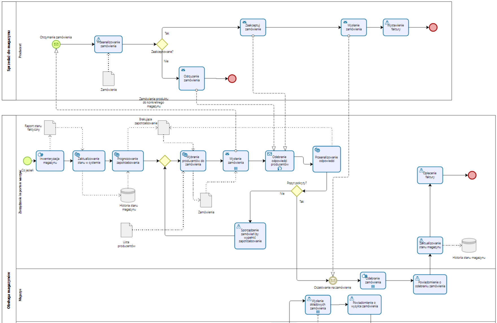

# WSYZ Projekt - Zespół 32
## Członkowie zespołu
* Łukasz Szydlik
* Dominik Śledziewski
* Tomasz Okoń

## **Opis Projektu**
Projekt dotyczy optymalizacji łańcucha dostaw czterech podstawowych warzyw (ziemniaki, kapusta, buraki, marchew) od grupy sześciu producentów, przez sieć trzech magazynów-chłodni, do dziesięciu sklepów w Warszawie i okolicach. Na początku przygotowywany jest diagram procesów w metodologii BPMN 2.0, który prezentuje przepływ towaru i informacji między producentami, magazynami i sklepami. Celem jest zbudowanie modelu decyzyjnego (w AMPL) minimalizującego koszty transportu, przy jednoczesnym uwzględnieniu ograniczeń produkcyjnych, pojemności magazynów i prognozowanego popytu tygodniowego. Projekt obejmuje również przygotowanie danych (popyt, odległości, moce, pojemności) oraz analizę wyników, by wskazać optymalny plan dostaw i zarządzanie zapasami.

## Lokalizacje
| Typ           | Miejscowość                 | Latitude ( ° N ) | Longitude ( ° E )                   |
| ------------- | --------------------------- | ---------------- | ----------------------------------- |
| Producent | Nieporęt                    | 52.4244      | 21.0336 |
|               | Książenice (pow. grodziski) | 52.0777      | 20.6965|
|               | Góra Kalwaria               | 51.9765      | 21.2154 |
|               | Otwock                      | 52.1170      | 21.2670 |
|               | Wołomin                     | 52.3500      | 21.2330 |
|               | Legionowo                   | 52.4000      | 20.9170 |
| Magazyn   | Pruszków                    | 52.1705      | 20.8119       |
|               | Piaseczno                   | 52.0814      | 21.0240      |
|               | Zielonka                    | 52.3005      | 21.1552       |

| Kod sklepu | Nazwa sieci / lokalizacja (dzielnica)    | Adres                                     | Pozycja GPS      |
| ---------- | ---------------------------------------- | ----------------------------------------- | ---------------- |
| S1     | Biedronka – Śródmieście              | ul. Marszałkowska 115, 00-102 Warszawa    | 52.2329, 21.0097 |
| S2     | Lidl – Bemowo                        | ul. Wrocławska 8/12, 01-493 Warszawa      | 52.2396, 20.9148 |
| S3     | Carrefour Express – Praga-Południe   | ul. Grochowska 210/212, 04-357 Warszawa   | 52.2446, 21.0790 |
| S4     | Auchan – Wawer (CH King Cross Praga) | ul. Jubilerska 1/3, 04-190 Warszawa       | 52.2353, 21.1194 |
| S5     | ALDI – Wola                          | ul. Górczewska 137, 01-459 Warszawa       | 52.2379, 20.9464 |
| S6     | Kaufland – Ursus                     | ul. Gierdziejewskiego 40, 02-495 Warszawa | 52.1897, 20.8680 |
| S7     | Netto – Białołęka                    | ul. Białołęcka 336, 03-253 Warszawa       | 52.3369, 21.0647 |
| S8     | E.Leclerc – Tarchomin (Białołęka)    | ul. Światowida 17, 03-144 Warszawa        | 52.3315, 20.9411 |
| S9     | Biedronka – Mokotów (Służewiec)      | ul. Postępu 14, 02-676 Warszawa           | 52.1816, 21.0073 |
| S10    | Biedronka – Praga-Północ             | ul. Ratuszowa 10, 03-461 Warszawa         | 52.2553, 21.0330 |

## Procesy biznesowe
Diagramy BPMN przygotowane w programie Bizagi Modeler, zdefiniowane w pliku Model-operacyjny.bpm

### Sprzedaż do magazynów
Proces przedstawia roczną, cykliczną współpracę pomiędzy magazynem a producentem warzyw.

Inicjacja po stronie magazynu
Każdej jesieni dział logistyki wykonuje inwentaryzację zapasów. Rzeczywisty stan magazynu jest wprowadzany do systemu ERP i archiwizowany w bazie „Historia stanu magazynu”. Na tej podstawie moduł analityczny prognozuje popyt na kolejny sezon. Jeśli przewidywane zapasy okażą się niewystarczające, system generuje listę braków.

Generowanie i wysyłka zamówień
Algorytm doboru dostawców (korzystający z modelu optymalizacyjnego bazującego m.in. na kosztach transportu) dobiera producentów i automatycznie tworzy zamówienia. Każde zamówienie jest przesyłane do wybranego producenta jako komunikat elektroniczny.

Obsługa zamówienia przez producenta
Po otrzymaniu dokumentu producent analizuje dostępność towaru i zdolności produkcyjne.

Jeśli zamówienie może być zrealizowane, producent odsyła akceptację, rozpoczyna kompletację towaru, wysyła partię i wystawia fakturę.

W przypadku braku możliwości wykonania zlecenia, producent wysyła odmowę, kończąc proces po swojej stronie.

Weryfikacja odpowiedzi w magazynie
Magazyn zbiera odpowiedzi wszystkich producentów i porównuje łączną zaakceptowaną ilość z prognozowanym zapotrzebowaniem.

Popyt pokryty – proces przechodzi do przyjęcia towaru, aktualizacji stanów i opłacenia faktur.

Popyt niepokryty – system automatycznie generuje dodatkowe zamówienia do alternatywnych producentów; pętla wysyłki i odbioru odpowiedzi powtarza się, dopóki prognozowany niedobór nie zniknie.

Zamknięcie cyklu
Po pełnym zaspokojeniu popytu i zaksięgowaniu faktur, stany magazynowe są ponownie zapisywane w bazie historycznej. Dane te stanowią wejście do prognozy w kolejnym roku, domykając roczny cykl „sprzedaż do magazynów”.

### Sprzedaż do sklepów
Proces odzwierciedla cotygodniową współpracę pomiędzy hurtownią (magazynem centralnym) a pojedynczym sklepem sieci.

Cotygodniowa inicjacja po stronie sklepu
W każdy piątek personel sklepu dokonuje inwentaryzacji przy-sklepowego magazynku. Stan faktyczny trafia do systemu sprzedażowego, gdzie – wraz z danymi prognostycznymi – wyliczane jest zapotrzebowanie na kolejny tydzień. Na tej podstawie system generuje dokument zamówienia.

Wybór i przekazanie zamówienia
Sklep może przesłać zamówienie do hurtowni trzema kanałami:

1. aplikacją
2. e-mailem
3. telefonicznie

Niezależnie od kanału treść dokumentu trafia do centralnej kolejki zamówień w dziale obsługi hurtowni.

Rejestracja i weryfikacja w hurtowni
Po scaleniu zamówień z wszystkich kanałów hurtownia sprawdza dostępność towaru oraz zdolności kompletacyjne magazynów regionalnych.

Gdy realizacja jest możliwa – hurtownia wysyła potwierdzenie przyjęcia zamówienia.

W razie braku towaru – zamówienie zostaje odrzucone, a proces po stronie sklepu kończy się bez dostawy.

Przydział magazynów i wysyłka towaru
Dla zaakceptowanych zleceń system optymalizacyjny przydziela pozycje zamówienia do konkretnych magazynów (np. M1, M2, M3), minimalizując koszt transportu i wykorzystując dostępne zapasy. Magazyny kompletują towar oraz wysyłają go do sklepu.

Odbiór dostawy i rozliczenie
Sklep po odbiorze towarów aktualizuje własny stan magazynku. Hurtownia wystawia fakturę, a po jej opłaceniu koryguje stany w bazie „Historia stanu magazynów”.

## Model optymalizacyjny
* Napisany w języku AMPL
* Pliki [mode.mod](ampl/model.mod) oraz [data.dat](ampl/data.dat) znajdują sie w folderze ampl
* Pliki wynikowe modelu znajdują sie w folderze [ampl/results](./ampl/results)
    ## Dane wejściowe
    | Producent | Ziemniaki | Kapusta | Buraki | Marchew |
    | --------- | --------- | ------- | ------ | ------- |
    | **P1**    | 200       | 90      | 120    | 60      |
    | **P2**    | 90        | 100     | 240    | 80      |
    | **P3**    | 80        | 70      | 190    | 150     |
    | **P4**    | 100       | 50      | 160    | 150     |
    | **P5**    | 140       | 230     | 90     | 210     |
    | **P6**    | 150       | 30      | 50     | 190     |

    | Magazyn | Pojemność (tony) |
    | ------- | ---------------- |
    | **M1**  | 800              |
    | **M2**  | 1100             |
    | **M3**  | 850              |

    * Losowo wygenerowane prognoza zapotrzebowania ([Plik generate_demand.py](generate_demand.py)) stanowiąca 90% możliwości produkcyjnych producentów
    * Poniżej tabela w formacie Markdown przedstawiająca moce produkcyjne producentów P1–P6 dla czterech warzyw:

    ## Dane wyjściowe (przekierowanie do pliku po kliknięciu)
    * [Łączny koszt transportu](ampl/results/koszt_transportu.txt)
    * [Wielkośc dostaw od producentów do magazynów (raz w roku)](ampl/results/transport_od_producentow_do_magazynow.txt)
    * [Wielkość dostaw z magazynów do sklepów dla każdego tygodnia w roku](ampl/results/transport_z_magazynow_do_sklepow.txt)
    * [Ilość warzyw przechowywanych w przysklepowych magazynach w kolejnych tygodniach](ampl/results/zapas_warzyw_w_sklepie.txt)
    * [Roczna ilość warzywa przechowywana w magazynie](ampl/results/zapaw_warzyw_w_magazynie.txt)

    ## Zbiory

    * **P** – Producenci (P1–P6)
    * **M** – Magazyny (M1–M3)
    * **S** – Sklepy (S1–S10)
    * **V** – Warzywa {Ziemniaki, Kapusta, Buraki, Marchew}
    * **T** – Tygodnie roku {1,…,52}

    ---

    ## Parametry

    | Symbol      | Wymiary   | Opis                                                            |
    | ----------- | --------- | --------------------------------------------------------------- |
    | `SP[p,v]`   | P × V     | Roczna podaż warzywa *v* od producenta *p* (t)                  |
    | `WC[m]`     | M         | Pojemność magazynu *m* (t)                                      |
    | `D[s,v,t]`  | S × V × T | Prognozowany popyt sklepu *s* na warzywo *v* w tygodniu *t* (t) |
    | `SC[s]`     | S         | Pojemność magazynu przysklepowego *s* (t)                       |
    | `MinS[s,v]` | S × V     | Minimalny zapas warzywa *v* w sklepie *s* (t)                   |
    | `d_pm[p,m]` | P × M     | Odległość producent **p → m** (km)                              |
    | `d_ms[m,s]` | M × S     | Odległość magazyn **m → s** (km)                                |
    | `c`         | —         | Koszt transportu (PLN · t⁻¹ · km⁻¹)                             |

    ## Zmienne

    | Zmienna      | Wymiary       | Interpretacja                                                         |
    | ------------ | ------------- | --------------------------------------------------------------------- |
    | `X[p,m,v]`   | P × M × V     | Tony warzywa *v* wysyłane rocznie z producenta *p* do magazynu *m*    |
    | `Y[m,s,v,t]` | M × S × V × T | Tony warzywa *v* wysyłane z magazynu *m* do sklepu *s* w tygodniu *t* |
    | `I[s,v,t]`   | S × V × T     | Zapas warzywa *v* w sklepie *s* na koniec tygodnia *t*                |
    | `W[m,v]`     | M × V         | Roczna ilość warzywa *v* przechowywana w magazynie *m*                |

    ## Funkcja celu

    Zminimalizować roczny koszt transportu:

    $$
    \min\; c \left(\sum_{p,m,v} d_{pm}\, X_{pmv}
                + \sum_{t,m,s,v} d_{ms}\, Y_{msvt}\right)
    $$

    ## Ograniczenia

    1. **Podaż producentów**

    $$
    \forall_{p,v}\; \sum_m X_{pmv} \le SP_{pv}
    $$
    2. **Pojemność magazynów**

    $$
    \forall_m\; \sum_v W_{mv} \le WC_m
    $$
    3. **Definicja zapasu w magazynie**

    $$
    \forall_{m,v}\; W_{mv} = \sum_p X_{pmv}
    $$
    4. **Bilans magazynów (roczny)**

    $$
    \forall_{m,v}\; \sum_p X_{pmv} = \sum_{t,s} Y_{msvt}
    $$
    5. **Bilans sklepów**

    * *Tydzień 1*:

        $$
        I_{sv1} = \sum_m Y_{msv1} - D_{sv1}
        $$
    * *Tygodnie ≥2*:

        $$
        \forall_{t>1,s,v}\; I_{svt} = I_{sv(t-1)} + \sum_m Y_{msvt} - D_{svt}
        $$
    6. **Pojemność sklepów**

    $$
    \forall_{s,t}\; \sum_v I_{svt} \le SC_s
    $$
    7. **Minimalny zapas**

    $$
    \forall_{s,v,t}\; I_{svt} \ge MinS_{sv}
    $$

    ---

